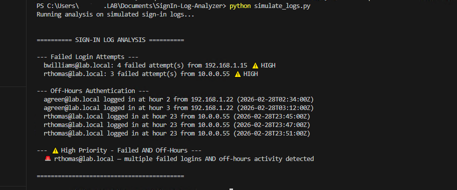
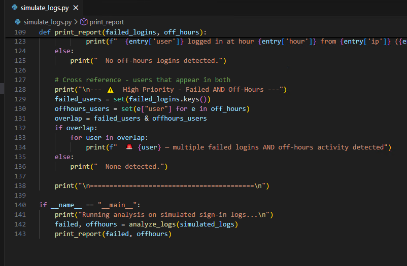
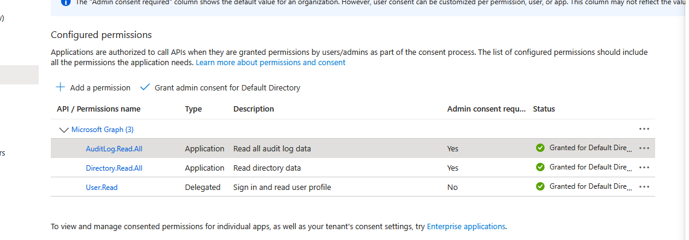
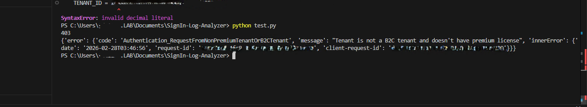
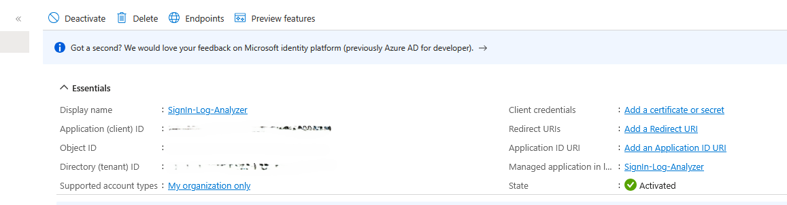

# Azure AD Sign-In Log Analyzer

## Overview
A Python-based security tool that analyzes Azure Active Directory sign-in logs to detect suspicious authentication behavior. Built as an extension of my Hybrid Active Directory Lab environment.

## What It Detects
- **Brute force indicators** — accounts exceeding failed login thresholds
- **Off-hours authentication** — logins occurring outside business hours (before 6AM or after 10PM)
- **High priority correlation** — accounts flagged for BOTH failed logins AND off-hours activity, elevated for immediate triage

## Detection Output

## How It Works
1. Authenticates to Microsoft Graph API using app registration and client credentials
2. Pulls sign-in log data from Azure AD audit logs
3. Parses each entry for error codes and timestamps
4. Correlates findings and outputs a prioritized report

## Detection Logic

## API Authentication
App registration was configured in Azure AD with the following Microsoft Graph permissions:
- `AuditLog.Read.All`
- `Directory.Read.All`

Authentication was validated against a live Azure tenant. The API returned a `403 Authentication_RequestFromNonPremiumTenantOrB2CTenant` error, confirming that credentials and permissions were configured correctly but sign-in log access requires Azure AD Premium P1/P2 licensing.

Simulated log data was used to demonstrate detection logic and analysis output in the absence of a premium license.

## Azure App Registration

## Environment
- Python 3.x
- Microsoft Graph API
- Azure AD (Free Tier)
- VirtualBox lab environment with Windows Server 2022 DC and Windows 10 client

## Skills Demonstrated
- Azure App Registration and API permission configuration
- OAuth 2.0 client credentials authentication flow
- Python scripting for security log analysis
- Detection logic and alert correlation
- Professional documentation of environment limitations

## Related Lab
This project extends my [Hybrid Active Directory Lab](https://github.com/tdt1114/hybrid-active-directory-lab)

## Notes
`config.py` contains tenant credentials and is excluded from this repository via `.gitignore`
