# KQL & Microsoft Sentinel Detection Lab

## Overview
A hands-on Detection Engineering lab using Microsoft Sentinel and KQL 
(Kusto Query Language) to ingest real Azure audit logs, write detection 
queries, build an automated alert rule mapped to MITRE ATT&CK, and 
visualize findings in a security dashboard.

Built as a continuation of the Azure AD Sign-In Log Analyzer and Python 
Detection Lab projects.

## Lab Environment
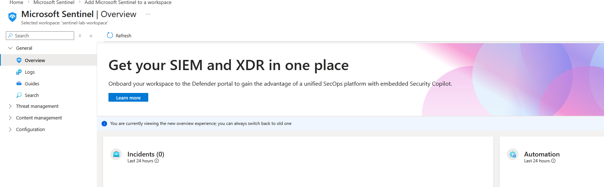

## Detection Pipeline
```
Entra ID Audit Logs → Microsoft Sentinel → KQL Queries → 
Automated Alert Rule → Security Dashboard
```

## Step 1 — Connect Data Source
Connected Microsoft Entra ID Audit Logs to Microsoft Sentinel as the 
primary data source. Sign-In Logs require Azure AD Premium P1/P2 — 
Audit Logs were used as the data source for this lab.

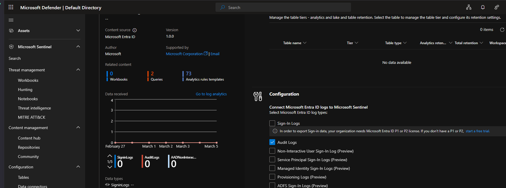

## Step 2 — Write KQL Queries

### Baseline Query — First Real Data
First query confirming Audit Log data was flowing into Sentinel.

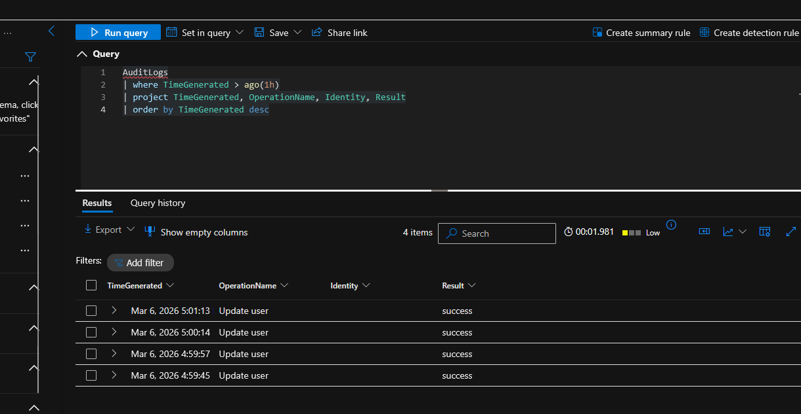

### Detection Query — Identity Changes
Query counting changes per identity to surface anomalous behavior.

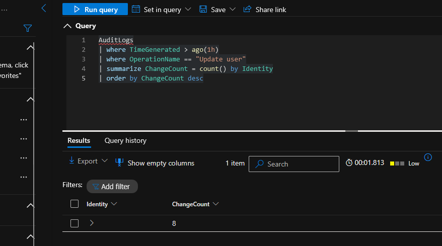

### Tuning — Alert Threshold
Added a threshold filter to reduce noise — same concept as 
`ALERT_THRESHOLD` in the Python Detection Lab, implemented in KQL.

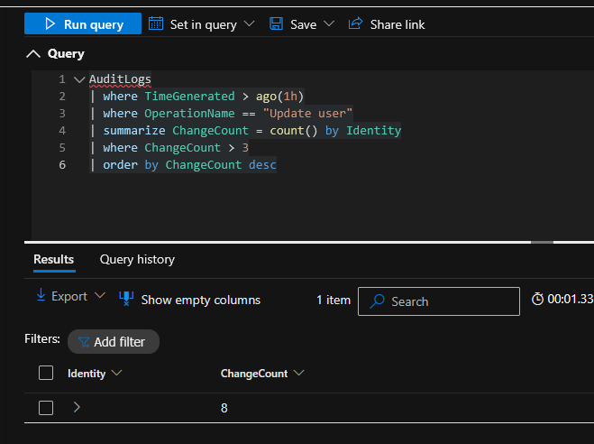

### Privilege Escalation Detection
Query detecting role assignments in Entra ID — a key indicator of 
privilege escalation activity.

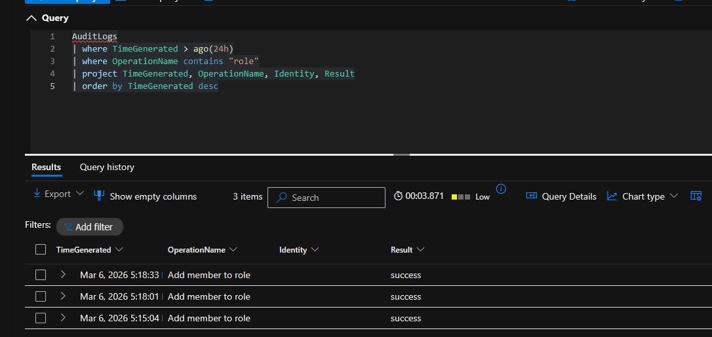

### Role Assignment Simulation
Generated real privilege escalation activity by assigning a user to 
the Global Reader role — triggering the detection query.

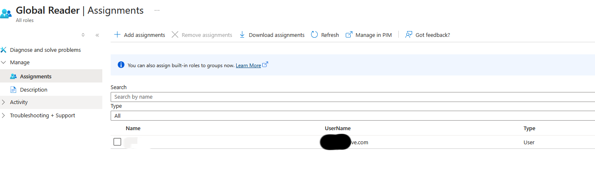

## Step 3 — Build Automated Alert Rule

### Before — Zero Rules
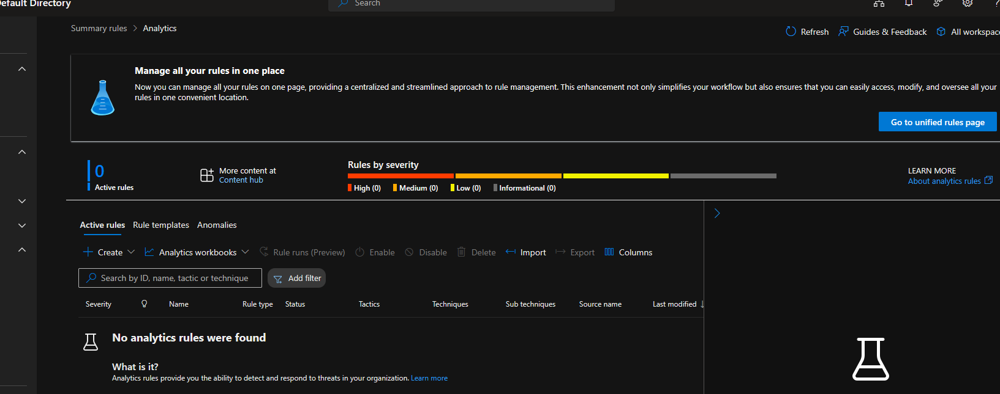

### Rule Configuration
Created a scheduled analytics rule running every 5 minutes, mapped 
to MITRE ATT&CK Privilege Escalation tactic, triggering on any role 
assignment activity.

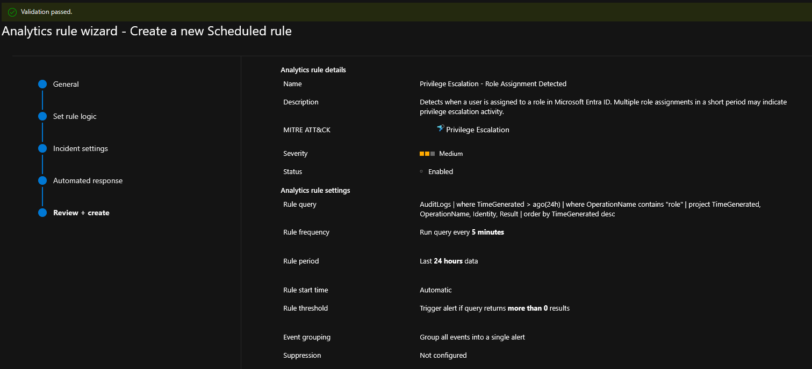

### After — Rule Live and Firing
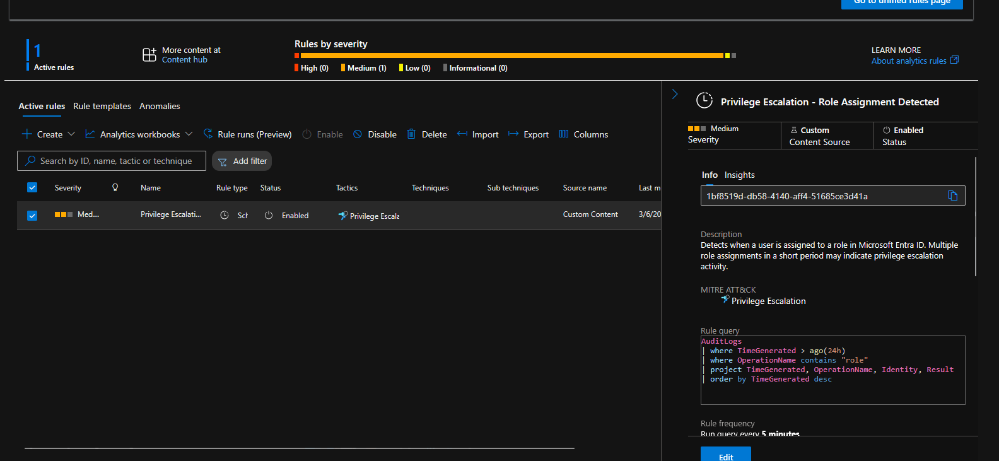

## Step 4 — Security Dashboard
Built a Sentinel workbook visualizing Audit Logs, Security Alerts, 
and Security Incidents in real time.

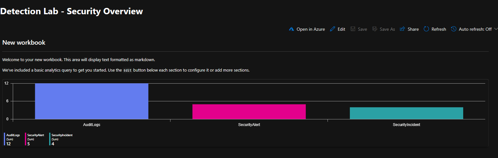

## KQL Queries Used

### Baseline Audit Log Query
```kql
AuditLogs
| where TimeGenerated > ago(1h)
| project TimeGenerated, OperationName, Identity, Result
| order by TimeGenerated desc
```

### Identity Change Count
```kql
AuditLogs
| where TimeGenerated > ago(1h)
| where OperationName == "Update user"
| summarize ChangeCount = count() by Identity
| order by ChangeCount desc
```

### Threshold Detection
```kql
AuditLogs
| where TimeGenerated > ago(1h)
| where OperationName == "Update user"
| summarize ChangeCount = count() by Identity
| where ChangeCount > 3
| order by ChangeCount desc
```

### Privilege Escalation Detection
```kql
AuditLogs
| where TimeGenerated > ago(24h)
| where OperationName contains "role"
| project TimeGenerated, OperationName, Identity, Result
| order by TimeGenerated desc
```

## Skills Demonstrated
- Microsoft Sentinel deployment and configuration
- Data connector setup and log ingestion
- KQL query writing for threat detection
- Detection threshold tuning
- MITRE ATT&CK tactic mapping
- Automated analytics rule creation
- Security workbook and dashboard building
- Privilege escalation simulation and detection

## Related Projects
This lab builds on:
- [Azure AD Sign-In Log Analyzer]
(https://github.com/tdt1114/azure-ad-signin-analyzer)
- [Python Detection Lab]
(https://github.com/tdt1114/azure-ad-signin-analyzer/tree/main/
python-detection-lab)
