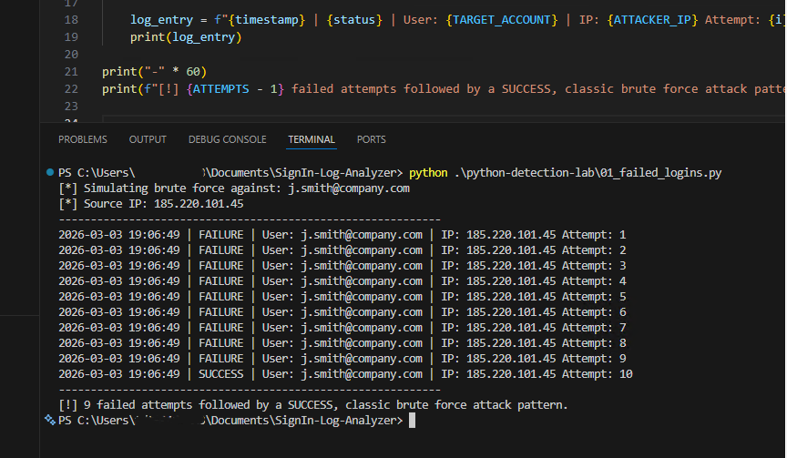
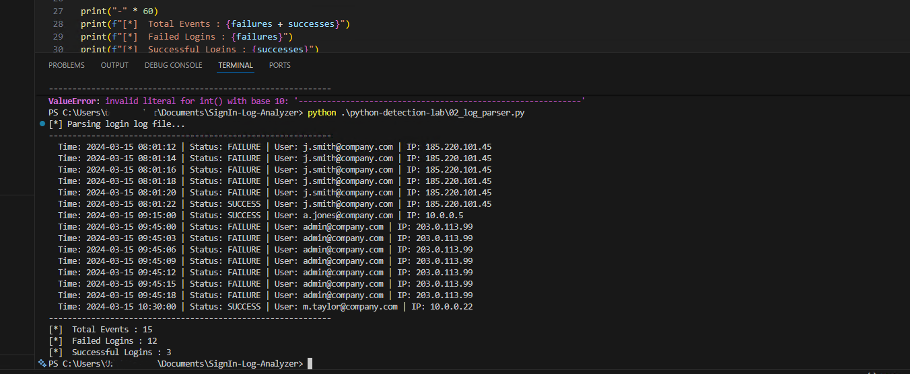
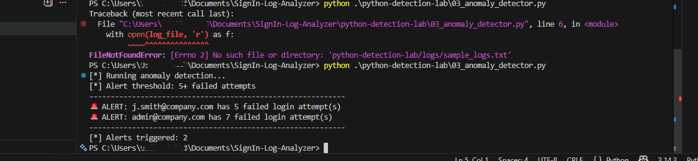
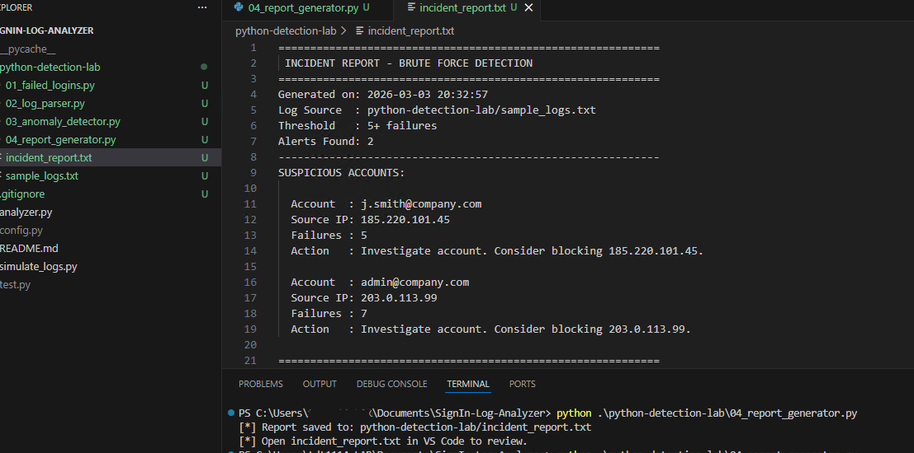
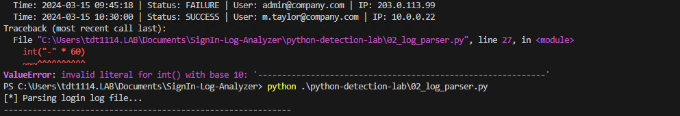
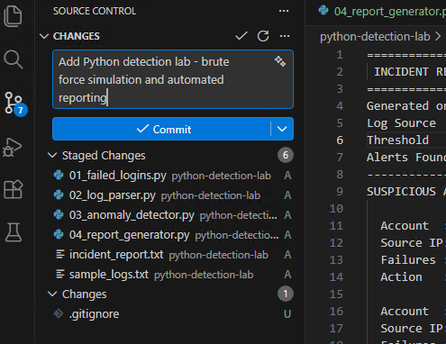

# Python Detection Lab

## Overview
A Python-based detection engineering lab that simulates brute force attacks against Azure AD accounts, parses sign-in logs, automatically flags suspicious behavior, and generates an incident report. Built as an extension of the Azure AD Sign-In Log Analyzer project.

## Detection Pipeline
```
Raw Logs → Parse → Detect → Report
```

## Scripts

### 01 - Brute Force Simulation
Simulates a brute force attack by generating failed login attempts against a target account. Mirrors the manual login simulation from the Azure AD lab — now automated with Python.



### 02 - Log Parser
Reads raw sign-in log data line by line, extracts structured fields, and counts total events, failures, and successes.



### 03 - Anomaly Detector
Applies a configurable threshold to flag accounts with excessive failed logins. 
Applies a configurable threshold to flag accounts with excessive failed logins. Adjust `ALERT_THRESHOLD` to tune sensitivity and reduce false positives.



### 04 - Report Generator
Automatically generates a formatted incident report from the detection findings — including suspicious accounts, source IPs, failure counts, and recommended actions.



## Troubleshooting & Debugging
Real problem solving documented during the build — a syntax error caught and fixed during development.



## Git Workflow


## v2 Refactor — Detection as Code Pipeline

After the initial build, the lab was restructured to reflect production detection pipeline design.

**What changed:**

- `config.py` — all constants (file paths, thresholds, simulation settings) centralized in one place. Change a value once, it propagates everywhere.
- Functions — each script's logic wrapped in a named function (`simulate_bruteforce`, `parse_logs`, `detect_anomalies`, `generate_report`) for modularity and reuse.
- `main.py` — orchestrator that runs the full pipeline end to end with a single command.
- `argparse` — threshold and log file path are now configurable at runtime without touching the code.

**Why it matters:**

The original scripts were sequential and self-contained. The refactor makes this a proper pipeline — parse once, pass data forward, generate output. It reflects how detection tooling is built in production environments where detections are versioned, testable, and configurable.

**Usage:**
```bash
# Run with defaults from config.py
python main.py

# Override threshold at runtime
python main.py --threshold 6

# Specify a different log file
python main.py --log-file sample_logs.txt --threshold 3
```
## Skills Demonstrated
- Python scripting for security log analysis
- Detection as Code — modular, versioned, configurable pipeline design
- Detection logic with configurable thresholds
- Alert tuning to reduce false positives
- Automated incident report generation
- Debugging and troubleshooting Python scripts
- Professional Git workflow and documentation

## Related Project
This lab extends the [Azure AD Sign-In Log Analyzer](https://github.com/tdt1114/azure-ad-signin-analyzer)
